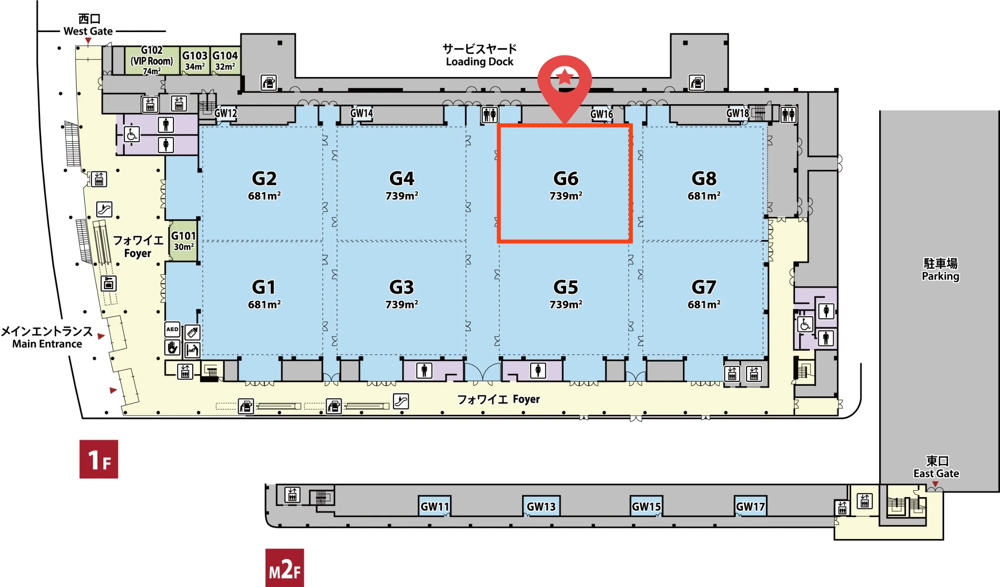

---
# Feel free to add content and custom Front Matter to this file.
# To modify the layout, see https://jekyllrb.com/docs/themes/#overriding-theme-defaults

permalink: /
title: Home
layout: home
---

<h1 class="page-heading">Embodied Social Intelligence for Scenario-Oriented Assistive and Service Robots</h1>

    June 1st or 5th, 2026 | Vienna, Austria | ICRA 2026

<!-- 

    <a href="">[Live Stream Link]</a>

 -->

<!-- <video autoplay muted loop style="object-fit: cover; height: 320px; width: 100%; border-radius: 8px; box-shadow: 0 4px 8px rgba(0,0,0,0.2);">
    <source src="assets/img/teaser_video.mp4" type="video/mp4">
    Your browser does not support the video tag.
</video> -->

 
 

Recent advances in sensing, actuation, and autonomy have enabled robots to move from labs into homes, clinics, stores, warehouses, and outdoor spaces. Service robots can navigate, assist, and collaborate with people, yet performance in constrained environments remains limited. Systems built for scripted interactions lack situational awareness, memory, and normative reasoning to personalize to families, negotiate hospital corridors, follow individuals in supermarkets, or generalize across scenarios. Foundation models and neuro-symbolic methods are transforming vision, language, and planning, but safe embodied deployment is still emerging.

This workshop asks: How can we achieve scenario-oriented embodied social intelligence that integrates multimodal perception, ethical decision making, and physical interaction; supports specialized models when needed; yet enables unified representations transferable across settings? 

Discussions will focus on a comprehensive set of challenges and solutions, with expert-led insights into:
<ol>
    <li><b>Multimodal social perception</b>: Real-time understanding of people, context, intent.</li>
    <li><b>Socially grounded decision making</b>: Norm-aware actions balancing risk and context.</li>
    <li><b>Embodiment and legible interaction</b>: Motion and contact conveying intent and comfort.</li>
    <li><b>Personalization and lifelong adaptation</b>: Memory-based personalization without drift.</li>
    <li><b>Open benchmarks and safety evaluation</b>: Scenario-spanning datasets and metrics.</li>
</ol>
We emphasize interdisciplinary collaboration across robotics, HRI, cognitive science, control, and ethics. The workshop will catalogue scenarios beyond current benchmarks, define specialized and unified social models, and establish scenario-weighted design guidelines and evaluation protocols to accelerate real-world deployment of socially competent robots.

<!--  -->

<section id="speakers">
    <h2 class="mb-4">Speakers</h2>
    

        
        

            

                

                    
                

                

                    <h5 class="card-title  text-center"><a href="{{ speaker.webpage }}"> {{speaker.name}} </a></h5>
                    <h5 class="card-title  text-center">
                    <a href="{{ speaker.affil_link }}">{{ speaker.affil }}</a></h5>
                    <!-- 
{{ speaker.bio }}
 -->
                

            

        

        
    

</section>

<!-- Call for Papers -->

<section id="papers">
    <h2 class="mb-3">Call For Papers</h2>
    
Submission deadline: <s>April 6th, 11:59pm AOE, 2026</s> <b>April 7th, 11:59pm AOE, 2026</b>

    
Review and decision: <b>April 20th, 2026</b>

    
Camera-ready deadline: <b>May 11th, 2026</b>

    

    <a href="">Openreview Submission Link</a>
    

     
     We invite submissions of extended abstracts and position papers (2–4 pages, excluding acknowledgements and references) in the IEEE Conference format. In addition, we welcome video and demo submissions that showcase innovative approaches in manipulation. The related topics include but are not limited to:
    <ul style="display:grid; grid-template-columns:1fr 1fr; gap:0.5em 2em; list-style-type: disc; padding-left: 1.2em;">
        <li>Multimodal Social Perception (context, intent)</li>
        <li>Socially Aware Navigation & Person Following</li>
        <li>Scenario Taxonomy & Real-World Deployment</li>
        <li>Norm-Aware Decision Making & Ethics</li>
        <li>Embodied, Legible Interaction</li>
        <li>Personalization, User Modeling & Memory</li>
        <li>Lifelong Learning & Adaptation</li>
        <li>Foundation Models for Embodied Agents</li>
        <li>Neuro-Symbolic Planning & Task Logic</li>
        <li>Shared Autonomy in Social Contexts</li>
        <li>Safety and Comfort Evaluation</li>
        <li>Sim-to-Real for Social Interaction (digital twins)</li>
        <li>Robustness to Open-World Uncertainty</li>
        <li>Privacy-Preserving Sensing & Data Governance</li>
        <li>Multi-Agent & Crowd Interaction</li>
        <li>Trust, Explainability & Human Studies in HRI</li>
    </ul>
    Accepted papers will be presented as spotlight talks and/or posters. The accepted papers will be made available on the workshop website with the authors' consent. All papers will be presented on-site during the workshop.
    

        
<strong>We are pleased to present:</strong>

        <ul style="margin: 0.5em 0 1em 1.2em;">
            <li>Two <strong>Best Workshop Paper Awards</strong> (150 USD each), sponsored by <em>Galbot Co., Ltd</em></li>
            <li>Three <strong>Second Best Workshop Paper Awards</strong> (50 USD each), sponsored by <em>albot Co., Ltd</em></li>
        </ul>
        
Winners will receive the monetary prize and a certificate.

    

     
     
    <!-- <h4 class="mb-3">Submission Guidelines</h4>
    
The review process will be single-blind. Submissions will be evaluated based on originality, technical quality, and relevance to
    the workshop themes. The review process will not be public; only the accepted papers will be available on the workshop 
    website, given the authors' consent.

    
There is <b>no</b> strict page limit; however, we encourage submissions to be within 4-8 pages (excluding references) to 
    facilitate thorough review. Papers should be submitted in PDF, adhering to the ICRA template and our submission guidelines. Also, we encourage authors to submit videos, code, or data in their supplementary material (zip file) or through external services like Github repos.

    
<b>Additionally</b>, to encourage discussion on the workshop topic, we ask authors to provide 1~2 paragraphs of statements on how their work relates to the workshop theme. This information will help us organize the workshop discussion and better feature the accepted works on the website.
 -->
    
</section>

<section id="schedules">
    <h2 class="mb-3">Schedule</h2>
    <!-- Schedule -->
    <!-- Comment out the following line and uncomment it if there is urgent notice about schedule.  -->
    <!-- 
Important notice.
 -->
    

    

        00
        days
    

    

        00
        hours
    

    

        00
        minutes
    

    

    

    

    

        

        <input type="radio" id="tokyo-time-btn" name="timezone" class="timezone-radio" onclick="selectTokyoTime()" checked>
        <label for="tokyo-time-btn" class="timezone-label">EU Time</label>
        <input type="radio" id="local-time-btn" onclick="selectLocalTime()" name="timezone" class="timezone-radio">
        <label for="local-time-btn" class="timezone-label">Local Time</label>
        

    

    <table>
        
        <tr class="schedule-row" data-event-time="{{ scheduleitem.time }}" data-event-type="{{ scheduleitem.type }}">
            <td class="time-cell" data-tokyo-time="{{ scheduleitem.time }}">
                <!-- Initially shows Tokyo time; will be updated by JavaScript -->
                

                <!-- {{ scheduleitem.time }} -->
                    

                    

                

            </td>
            <td align="center">
                

                    <b>{{ scheduleitem.title }}</b>
                

                 
                
                

                    {{ scheduleitem.description }}
                

                
            </td>
            <td>
                

                    <!-- scheduleitem name (link to webpage if provided) -->
                    
                        <a href="{{ scheduleitem.speaker_webpage }}" target="_blank">{{ scheduleitem.speaker }}</a>
                    
                        {{ scheduleitem.speaker }}
                    
                     
                    <!-- scheduleitem affiliation (if provided) -->
                    
                        {{ scheduleitem.affiliation }}
                    
                

            </td>
        </tr>
        
    </table>
    

</section>

<!-- Force time display in the table -->

<!-- <section id="workshop-location" class="mt-5">
    <h2 class="mb-3">Workshop Location</h2>
    

        

            
        

    

</section> -->

<!-- Organizers Section -->
<section id="organizers" class="mt-5">
    <h2 class="mb-3">Organizers</h2>
    

        
            
                

                    

                        

                            
                        

                        

                            <h5 class="card-title text-center">
                                <a href="{{ organizer.webpage }}">{{ organizer.name }}</a>
                            </h5>
                            <h5 class="card-title text-center">
                                <a href="{{ organizer.affil_link }}">{{ organizer.affil }}</a>
                            </h5>
                        

                    

                

            
        
    

</section>

<!-- Organizers Section -->
<!-- <section id="organizers" class="mt-5">
    <h2 class="mb-3">Advisory Board</h2>
    

        
            
                

                    

                        

                            
                        

                        

                            <h5 class="card-title text-center">
                                <a href="{{ organizer.webpage }}">{{ organizer.name }}</a>
                            </h5>
                            <h5 class="card-title text-center">
                                <a href="{{ organizer.affil_link }}">{{ organizer.affil }}</a>
                            </h5>
                        

                    

                

            
        
    

</section> -->

<section id="sponsors">
    <h2 class="mb-4">Sponsors</h2>
    

        
        

            

                

                    
                

                

                    <h5 class="card-title  text-center"><a href="{{ sponsor.webpage }}"> {{sponsor.name}} </a></h5>
                

            

        

        
    

</section>
